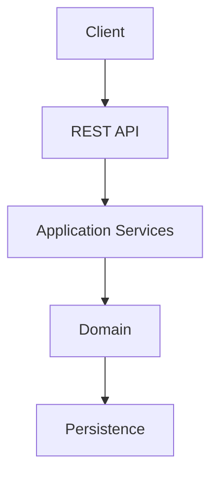

# Architecture

_Last updated: <date> — generated/refreshed by the `architecture-doc`
agent from the codebase at commit <sha, if known>. See "Sources" notes
per section for what backs each claim._

## 1. Overview

<what this service does, its boundaries, who/what calls it>

## 2. Architecture



**Sources:** <packages/modules this layering was derived from>

## 3. Components

### API
<responsibilities — derived from controller package>

### Application
<responsibilities — derived from service/use-case package>

### Domain
<responsibilities — derived from domain/model package>

### Infrastructure
<responsibilities — derived from repository/client/adapter package>

**Sources:** <packages this was derived from>

## 4. Data Flow

### <Flow name, e.g. "Payment authorization">

```mermaid
sequenceDiagram
  %% actual call path, including retry/fallback branches where they exist
```

**Sources:** <files this was traced through>

## 5. External Systems

| System | Protocol | Purpose | Key config properties | Source |
|---|---|---|---|---|
| Aurora | JDBC | Persistence | `spring.datasource.url`, ... | `application.yml` |
| Kafka | Kafka | Events | `spring.kafka.bootstrap-servers`, topic: `<name>` | `application.yml` |
| <External API> | REST | <purpose> | `<client>.base-url`, timeout keys | `<config file>` |

Never include a real secret/credential value here — reference where it's
managed (secrets manager) instead of copying it.

## 6. Data Architecture

<high-level DB architecture and ownership — which service/team owns
which tables/schemas, and any shared-vs-exclusive ownership notes>

```mermaid
erDiagram
  %% derived from @Entity classes / migrations, not DTOs
```

**Sources:** <entity classes / migration files>

## 7. Security

**Authentication:** <mechanism actually configured — derived from Spring
Security config, OAuth2/JWT config, etc.>

**Authorization:** <mechanism — method security, filters, etc.>

**Secrets:** <how secrets are managed — which secrets manager/vault, not
values>

**Encryption:** <at-rest and in-transit mechanisms actually configured>

**Network security:** <e.g. mTLS, network policies, if present in
deployment config>

This section documents what's actually implemented; the rules that
govern how it's built and maintained live in
`.github/instructions/security.instructions.md` — don't duplicate that
content here, link to it.

**Sources:** <security config classes, deployment network policy files>

## 8. Deployment

<platform(s) — e.g. OpenShift, AWS — derived from actual IaC/deployment
manifests: Terraform, Helm values, OpenShift templates/DeploymentConfig.
Include resource limits, replica/autoscaling config, and environment
topology only where an actual manifest backs the number.>

**Sources:** <Terraform files, Helm charts, deployment manifests>

## 9. Reliability

Per the methodology in `references/sla-calculation.md`.

**Retries / timeouts / circuit breakers**

| Dependency | Timeout | Retries (attempts) | Backoff | Worst case | Source |
|---|---|---|---|---|---|
| <service> | <Xms> | <N> | <fixed/exp, params> | <computed> | `<config file/key>` |

**End-to-end worst case for <flow>:** <computed, sequential/parallel
reasoning shown>

**Dead-letter queues:** <which topics/queues have a DLQ configured, what
routes a message there, and whether/how it's reprocessed>

**Idempotency:** <how retried operations avoid duplicate side effects —
idempotency keys, upsert semantics, dedup tables — cite the actual
mechanism in code, not an assumption that retries are safe>

**Sources:** <resilience config, DLQ config, idempotency-key handling code>

## 10. Observability

**Logging:** <aggregation/format — derived from logging config>

**Metrics:** <what's exported and where — Micrometer/Prometheus config>

**Tracing:** <mechanism if configured — OpenTelemetry/Zipkin/etc.>

**Alerts:** <alerting rules if present in the repo as code — don't
describe alerts that only exist in a dashboard UI you can't verify from
code>

**Sources:** <observability config/dependencies>

## 11. Architectural Decisions

Significant, debatable design decisions live as individual ADRs in
`docs/decisions/`, not inline here — this section is an index only.

- [ADR-0001: <title>](../decisions/0001-<slug>.md)

## 12. Detailed Designs

Deep dives for major flows/components live in `docs/design/`, not inline
here — this section is an index only. Create one when a flow is complex
enough that this summary document can't do it justice (see the
`architecture-docs` skill for the threshold).

- [Order processing](../design/order-processing.md)
- [Kafka processing](../design/kafka-processing.md)
- [Database](../design/database.md)
